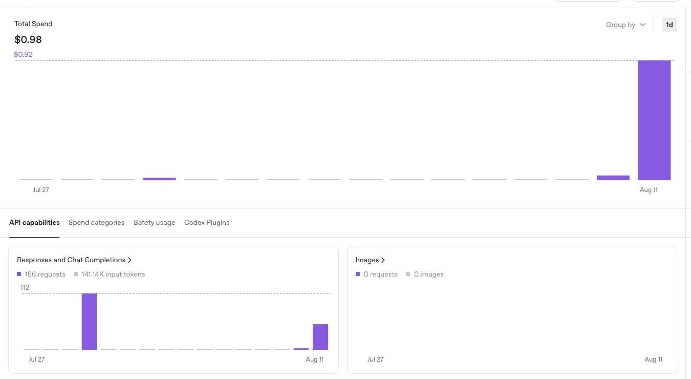
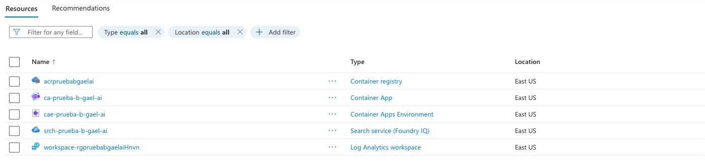
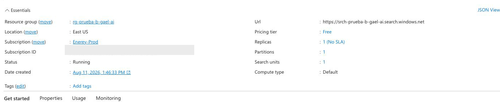
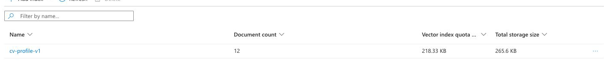
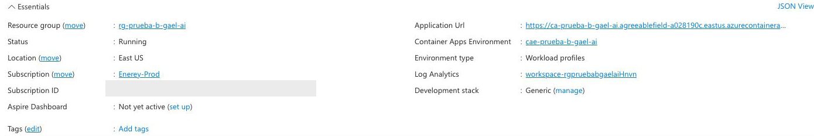
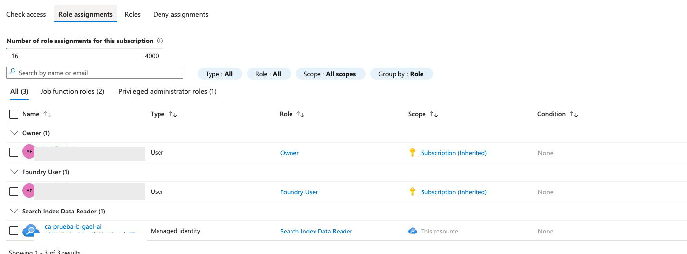
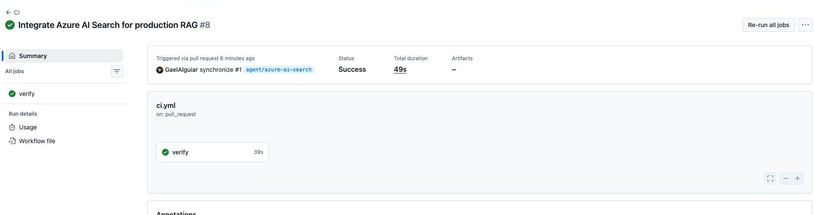
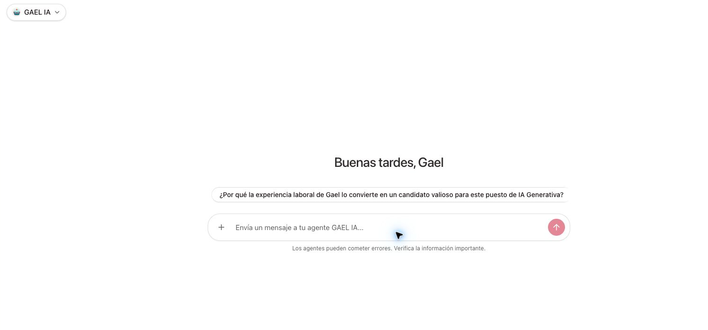

# Evidencias visuales de la demostración

Guarda aquí las capturas utilizadas para documentar la solución. Antes de
subirlas, verifica que no muestren claves, tokens, correos, identificadores de
suscripción ni información detallada de facturación.

## Archivos

1. `01-openai-usage.png`
   - Mostrar la gráfica general de uso y el periodo.
   - Ocultar organización, proyecto, presupuesto y cualquier clave.

2. `02-azure-components.png`
   - Mostrar los componentes desplegados: Container Registry, Container App,
     Container Apps Environment, Azure AI Search y Log Analytics.

3. `03-azure-ai-search-overview.png`
   - Mostrar `srch-prueba-b-gael-ai`, estado `Running`, ubicación `East US` y
     nivel `Free`.
   - No mostrar el identificador de la suscripción ni el correo de la cuenta.

4. `04-azure-search-index.png`
   - Mostrar el índice `cv-profile-v1` y la cantidad de documentos.
   - No abrir claves de administración ni query keys.

5. `05-container-app-overview.png`
   - Mostrar `ca-prueba-b-gael-ai`, estado saludable, URL pública y la imagen
     desplegada.
   - No abrir la sección Secrets.

6. `06-managed-identity-rbac.png`
   - Mostrar la identidad administrada y el rol `Search Index Data Reader`.
   - Evitar identificadores completos de principal o suscripción.

7. `07-github-ci.png`
   - Mostrar el Pull Request y los checks de CI aprobados.

8. `08-agent-platform.png`
   - Mostrar el agente registrado y una respuesta fundamentada sobre la
     experiencia laboral de Gael.

Usa formato PNG, resolución legible y el mismo nivel de zoom en todas las
capturas. No edites una imagen para aparentar un estado distinto del recurso
real.

## Galería

| Evidencia | Captura |
| --- | --- |
| Consumo de OpenAI |  |
| Componentes en Azure |  |
| Azure AI Search |  |
| Índice vectorial |  |
| Azure Container Apps |  |
| Identidad administrada y RBAC |  |
| Integración continua |  |
| Agente registrado |  |
